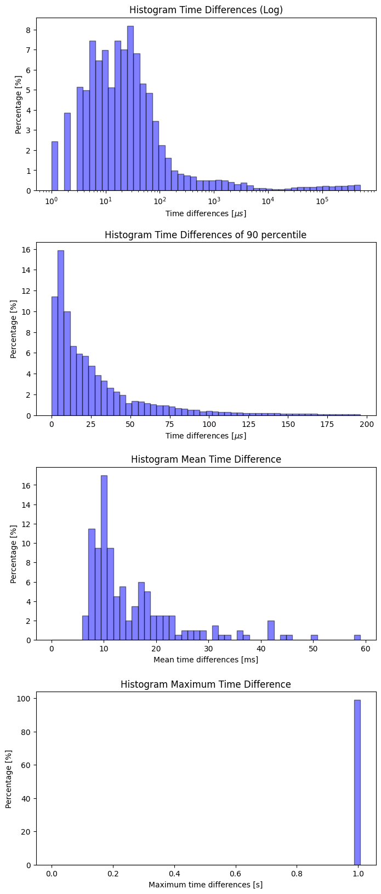
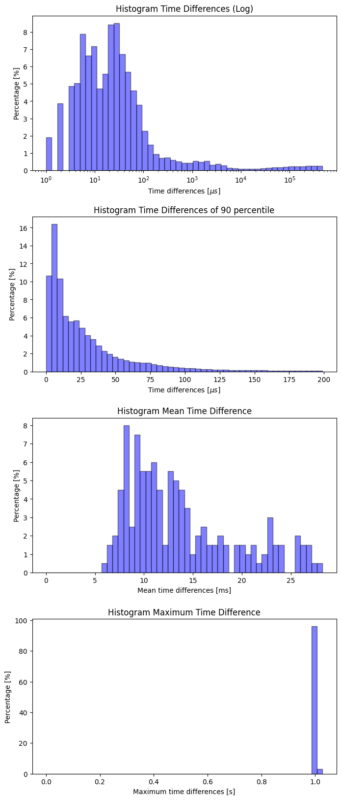

## Intro
A first possible countermeasure to current and future cyber attacks is to use Intrusion Detection Systems (IDS). Unlike network intrusion detection systems (NIDS), host-based intrusion detection systems (HIDS) record data of the system to be monitored. In recent years, experiments have demonstrated that system calls of the hosts can be used to successfully identify attacks. These methods, often based on anomaly detection, are also able to detect previously unknown attacks. In most cases, the sequences of the system calls is analyzed. Other methods did not consider the sequences but the frequencies of occurring system calls.

Available datasets have some of the following problems:

- outdated
- lack of thread information
- lack of metadata like arguments, timestamps and return values of system calls
- small amount of data

To overcome the mentioned problems the new [Leipzig Intrusion Detection - Data Set (LID-DS)](https://www.exploids.de/lid-ds/) contains a multitude of data, associated with system calls, and recorded on modern operating systems with current software and different types of attacks. This recorded data contains the system call IDs, their parameters and return values. Additionally it includes corresponding metadata such as process IDs, process names and timestamps. LID-DS consists of several scenarios, each containing an attackable system. For each included scenario, two categories of traces were recorded. The normal behavior of the attacked system (victim) and the behavior of the victim under attack [^1].


## Recorded Information

Each of the scenario archives contains about 1000 files with normal behavior and about 100 files with normal and exploited behavior. In addition, each archive contains a runs.csv file with the following format:

```
image_name, scenario_name, is_executing_exploit, warmup_time, recording_time, exploit_start_time
```

This file tells you how long the recording took, whether it was normal or attack behavior, and if so, when the attack started.

The data files have the following format:

```
event_number event_time cpu user_uid process_name thread_id event_direction event_type event_arguments
```

For example:

```
1159 00:27:12.310259734 6 33 apache2 15862 > writev fd=12(<4t>172.17.0.21:46790->172.17.0.19:443) size=31
1160 00:27:12.310311837 6 33 apache2 15862 < writev res=31 data=..............
```

## Attack Scenarios Overview
All of the following statistics are computed from the first 200 normal training runs for each scenario.

### Key Metrics

  Scenario               Number of Syscalls Min. Timedelta [$\mu s$] Max. Timedelta [$\mu s$]  Average Timedelta [$\mu s$]
  ---------------------- -----------------  ------------------------ ------------------------  --------------------------
  ZipSlip               46598581           1                         1980879                  185.77
  EPS_CWE-434            23323742           1                         1001968                  376.77
  CVE-2018-3760          3160581            1                         2000205                  2702.55
  CVE-2019-5418          3221008            1                         1000614                  2734.53
  CVE-2017-7529          304046             1                         10935735                 25896.99
  CVE-2012-2122          634603             1                         1999426                  13876.16
  Bruteforce_CWE-307     716256             1                         1933669                  12189.41
  SQL_Injection_CWE-89   3692253            1                         943101                   2414.22
  CVE-2014-0160          696116             1                         1009404                  12584.32
  PHP_CWE-434            3759388            1                         3305859                  2336.23
  CVE-2012-2122          304046             1                         10935735                 25896.99
  CVE-2018-3760          304046             1                         10935735                 25896.99
  CVE-2017-7529          304046             1                         10935735                 25896.99


### CVE4-2014-0160 "Heartbleed"
The bug allows attackers to read memory contents from the server due to a bug in the implementation of OpenSSL and thus possibly get access to secret keys and other sensitive data.

- [Animation anomaly](figures/CVE-2014-0160_melted_carson_1329_True.html)
- [Animation regular](figures/CVE-2014-0160_itchy_davinci_4564_False.html)



### CWE-307
Improper Restriction of Excessive Authentication Attempts: Brute force username and password guessing attempt.

- [Animation anomaly](figures/Bruteforce_CWE-307_nice_almeida_9203_True.html)
- [Animation regular](figures/Bruteforce_CWE-307_weak_heisenberg_2728_False.html)



### CWE-89
SQL Injection: The insertion of attacker-controlled data into variables that are used to construct SQL commands.

- [Animation anomaly](figures/SQL_Injection_CWE-89_polite_wescoff_8069_True.html)
- [Animation regular](figures/SQL_Injection_CWE-89_full_payne_5501_False.html)


### CWE5-434
Unrestricted Upload of File with Dangerous Type (PHP): The attacker is allowed to upload files of dangerous type, like php scripts, that can be processed within the victims environment.

- [Animation anomaly](figures/PHP_CWE-434_grumpy_carson_5824_True.html)
- [Animation regular](figures/PHP_CWE-434_ripe_hugle_6081_False.html)


### CWE-434
Unrestricted Upload of File with Dangerous Type (eps): A service is converting images from different image formats to the svg file format. One supported format, the Encapsulated PostScript actually is a scripting language.

- [Animation anomaly](figures/EPS_CWE-434_fluffy_northcutt_5295_True.html)
- [Animation regular](figures/EPS_CWE-434_brave_edison_9580_False.html)


### CVE-2012-2122
MySQL authentification bypass.

- [Animation anomaly](figures/CVE-2012-2122_raspy_moore_2582_True.html)
- [Animation regular](figures/CVE-2012-2122_brief_khayyam_4347_False.html)


### CVE-2017-7529
Nginx integer overflow vulnerability.

- [Animation anomaly](figures/CVE-2017-7529_scruffy_kare_6242_True.html)
- [Animation regular](figures/CVE-2017-7529_deep_thompson_5079_False.html)


### CVE-2018-3760
Sprockets information leak vulnerability.

- [Animation anomaly](figures/CVE-2018-3760_inexpensive_noyce_1736_True.html)
- [Animation regular](figures/CVE-2018-3760_enough_pike_8024_False.html)


### CVE-2019-5418
Rails file content disclosure vulnerability.

- [Animation anomaly](figures/CVE-2019-5418_vast_maxwell_3286_True.html)
- [Animation regular](figures/CVE-2019-5418_fat_thompson_8421_False.html)


### ZipSlip
ZipSlip is a widespread arbitrary file overwrite critical vulnerability, which typically results in remote command execution. Was in Projects like: Hadoop and Maven. It is known under several CVEs.


- [Animation anomaly](figures/ZipSlip_dirty_blackwell_7369_True.html)
- [Animation regular](figures/ZipSlip_shy_rhodes_1001_False.html)


[^1]: Martin Grimmer; Martin Max Röhling; Dennis Kreusel; Simon Ganz, A Modern and Sophisticated Host Based Intrusion Detection Data Set, 16. Deutscher IT-Sicherheitskongress, 2019
